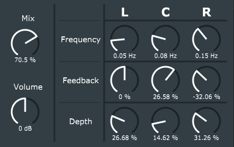

# LCR Chorus

Left-right-center -chorus effect made with JUCE (v5.4.3). Allows the user to adjust LFO frequency and depth as well as feedback for three separate delay lines. The delay lines have been panned to left, center and right (thus the name LCR-chorus) and they have a phase difference of 90 degrees (left at 90, center at 0 and right at 270).

		
	

